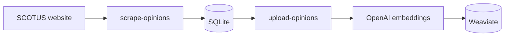

# scotus-helper

A RAG-powered chat app for exploring [U.S. Supreme Court slip opinions](https://www.supremecourt.gov/opinions/opinions.aspx). Ask questions across indexed merits and orders opinions; get answers streamed from `gpt-4o` with source citations linked to the original PDFs. A daily cron job keeps the corpus current.

## Architecture

### Ingestion

Opinions are scraped from the SCOTUS website, extracted from PDFs, and stored in SQLite. They are then chunked, embedded, and upserted into Weaviate on upload. This runs once on setup and daily via cron.



### Chat query flow

Each user query passes through several stages before a response is streamed:

1. **Selector** (`gpt-4o-mini`) — normalizes the query, checks whether it is on-topic, and picks a retrieval strategy: `sql`, `vector`, `both`, or `none`. Off-topic queries are rejected with `400`.
2. **Retrieval** — runs as needed based on the selector's decision:
   - **Vector**: embeds the query (`text-embedding-3-small`) and searches Weaviate for the most similar opinion chunks.
   - **SQL**: generates and executes a read-only `SELECT` against SQLite (`gpt-4o`).
3. **Reranking** (Cohere `rerank-v3.5`) — scores and reorders the combined retrieval results to surface the most relevant context.
4. **Generation** (`gpt-4o`) — streams an answer grounded in the reranked context. Source citations are returned in the `X-Sources` response header as a base64-encoded JSON array.

## Setup

Follow these steps or see [Docker](#docker):

1. Install dependencies

    ```shell
    npm install
    ```

2. Set up environment variables in `.env` (see [`.env.example`](./.env.example)).

3. Scrape opinions

    ```shell
    npm run scrape-opinions
    ```

4. Start Weaviate locally via Docker

    ```shell
    docker compose up -d weaviate
    ```

5. Upload opinions

    ```shell
    npm run upload-opinions
    ```

6. Run the chat app locally

    ```shell
    npm run dev
    ```

7. Then open `http://localhost:3000` and start asking questions!

## Docker

The repo includes a multi-stage `Dockerfile` and a `docker-compose.yml` that bring up the Next.js web app and Weaviate together. A `Makefile` wraps every `docker compose` command and automatically injects your host `UID`/`GID` as build args so files written into the `./data` volume are owned by you, not root.

### Running the full stack

```shell
cp .env.example .env   # fill in OPENAI_API_KEY, COHERE_API_KEY
make up
```

The app will be available at `http://localhost:3000`. Weaviate data is persisted in a named Docker volume (`weaviate_data`).

### Automatic daily sync (cron)

The `cron` service runs `scrape-opinions` followed by `upload-opinions` every day at **08:00 UTC**. It starts automatically with `make up`.

View its output:

```shell
make logs SERVICE=cron
```

To change the schedule, edit the `RUN echo "0 8 * * * …"` line in `Dockerfile.cron` using standard cron syntax, then rebuild:

```shell
make build
docker compose up -d cron
```

### Running scripts against the Dockerized stack

Use the [Makefile](./Makefile)

```shell
make scrape   # scrape opinions and store in SQLite
make upload   # upload opinion chunks to Weaviate
make inspect  # inspect Weaviate health and collection counts
```

## Scripts

1. `npm run scrape-opinions` — fetches the merits and orders listing pages, downloads each PDF, extracts text, and upserts opinion rows into SQLite (`data/opinions.db`). If a listing link includes `#page=N`, only pages from that start through the next opinion in the same file (or the end of the PDF) are stored; otherwise the whole PDF is used. Rows that share the same file batch one download. Defaults to the current term.

    | Flag | Behaviour |
    | ---- | --------- |
    | _(none)_ | current term only |
    | `-- --all` | all terms from 2018 to present |
    | `-- --term 24` or `-- --term 2024` | October Term 2024 only |

2. `npm run upload-opinions` — for each opinion in SQLite, chunks the text and calls OpenAI (`text-embedding-3-small`) to generate embeddings, caching results in an `opinion_chunks` table so re-runs skip already-embedded opinions. Then batch-upserts all chunks as vectors into Weaviate (`SupremeCourtOpinions` collection, created automatically if absent).

3. `npm run inspect-weaviate` — prints Weaviate health (live/ready/version), lists all collections, and for `SupremeCourtOpinions` shows the object count and a sample object.

## Test

Run all tests

```shell
npm test
```

## API

### `POST /api/selector`

Normalizes the query, checks whether it is on-topic for U.S. Supreme Court opinions, and picks a retrieval strategy. Uses `gpt-4o-mini` (LangSmith-wrapped).

Request shape:

```ts
{ query: string }
```

Response shape:

```ts
{
  normalizedQuery: string;
  isOnTopic: boolean;
  queryType: "sql" | "vector" | "both" | "none";
  reason: string;
}
```

### `POST /api/sql-query-generator`

Takes a normalized user query (from the [selector](./src/libs/selector.ts)) and returns a read-only `SELECT` for the [SQLite schema](./src/db.ts) (`gpt-4o`, LangSmith-wrapped). Used by the chat flow when structured retrieval is needed.

Request shape:

```ts
{ normalizedQuery: string }
```

Response shape:

```ts
{
  sqlQuery: string;
  reason: string;
}
```

### `POST /api/chat`

Runs the selector in-process, retrieves context via vector search and/or SQL as needed, reranks the results with Cohere, then streams a `gpt-4o` response. Off-topic queries are rejected with `400`. Source citations are returned in the `X-Sources` response header as a base64-encoded JSON array. See the [Architecture](#architecture) section for the full flow.

Request shape:

```ts
{ query: string }
```

Response shape:

```ts
// Streaming plain-text body; X-Sources header contains base64-encoded JSON:
Array<{
  caseName: string;
  docket?: string;
  pdfUrl: string;
}>
```

## Tech stack

- **Web framework**: Next.js 15 (React 19, App Router)
- **Scraping**: axios + cheerio
- **PDF extraction**: pdf-parse
- **Database**: SQLite via better-sqlite3 + Kysely (type-safe query builder)
- **Embeddings**: OpenAI `text-embedding-3-small`
- **Query routing**: OpenAI `gpt-4o-mini` (selector: normalize + topic filter + SQL/vector/both)
- **Chat**: OpenAI `gpt-4o`
- **Reranking**: Cohere `rerank-v3.5`
- **Vector store**: Weaviate (local, via Docker)
- **Validation**: Zod
- **Observability**: LangSmith (optional tracing)

## Data sources

- Merits: `https://www.supremecourt.gov/opinions/slipopinion`
- Orders: `https://www.supremecourt.gov/opinions/relatingtoorders`

---

### AI co-authors

- [Claude Sonnet 4.6](https://www.anthropic.com/claude/sonnet)
- [Cursor Composer 2](https://cursor.com/blog/composer-2)
