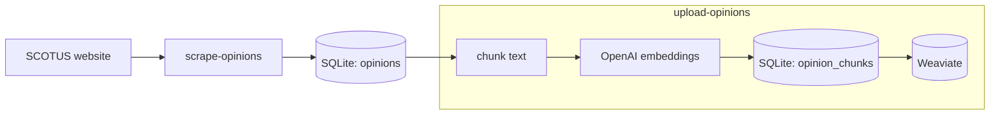
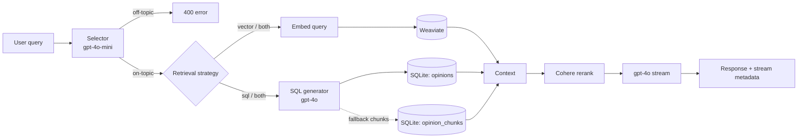

# scotus-helper

[](https://github.com/Isaac-DeFrain/scotus-helper/actions/workflows/ci.yml)
[](https://github.com/Isaac-DeFrain/scotus-helper/actions/workflows/release.yml)
[](https://github.com/Isaac-DeFrain/scotus-helper/actions/workflows/deploy.yml)

A RAG-powered chat app for exploring [U.S. Supreme Court slip opinions](https://www.supremecourt.gov/opinions/opinions.aspx). Ask questions across indexed merits and orders opinions; get answers streamed from `gpt-4o` with source citations linked to the original PDFs. A daily cron job keeps the corpus current.

## Architecture

### Ingestion

Opinions are scraped from the SCOTUS website, extracted from PDFs, and stored in SQLite (`opinions`). `upload-opinions` chunks each opinion, embeds via OpenAI, caches chunks and vectors in SQLite (`opinion_chunks`), then upserts them into Weaviate. This runs once on setup and daily via cron.



### Chat query flow

Each user query passes through several stages before a response is streamed:



1. **Selector** (`gpt-4o-mini`) — normalizes the query, checks whether it is on-topic, and picks a retrieval strategy: `sql`, `vector`, `both`, or `none`. Off-topic queries are rejected with `400`.
2. **Retrieval** — runs as needed based on the selector's decision:
   - **Vector**: embeds the query (`text-embedding-3-small`) and searches Weaviate for the most similar opinion chunks.
   - **SQL**: generates and executes a read-only `SELECT` against SQLite (`gpt-4o`). When no vector chunks were retrieved, matching rows are loaded from `opinion_chunks` by case name.
3. **Reranking** (Cohere `rerank-v3.5`) — scores and reorders the combined retrieval results to surface the most relevant context.
4. **Generation** (`gpt-4o`) — streams an answer grounded in the reranked context. Source citations and query stats are appended to the response body as a base64-encoded JSON suffix.

Exchanges are persisted to `chat.db` throughout this flow; see [Chat persistence and history](#chat-persistence-and-history).

### Chat persistence and history

Each chat request is persisted locally in SQLite (separate from `data/opinions.db`). Local dev uses `data/chat.db`; Docker stores chat analytics on a named volume at `/app/chat-data/chat.db` so the app can write without depending on `./data` ownership from scrape/cron. Persistence runs alongside the chat pipeline; write failures are logged but never fail the HTTP response.

```mermaid
flowchart LR
    UI[Browser<br/>userId in localStorage] -->|POST /api/chat| CHAT[/api/chat]
    UI -->|GET /api/analytics/*| AN[/api/analytics]

    subgraph write [Write path during chat]
        direction TB
        W1[persistChatQuery<br/>raw message]
        W2[persistNormalizedQuery<br/>after selector]
        W3[persistLangSmithTraceId<br/>on trace start]
        W4[persistChatResponse<br/>success / error / interrupted]
        W1 --> W2 --> W4
    end

    CHAT --> write
    W1 & W2 & W3 & W4 --> DB[(SQLite: chat.db)]
    AN -->|scoped by userId| DB

    Hist[History sidebar<br/>/history/:id] --> AN
    UI --> Hist
```

Tables in `chat.db`:

- `chat_queries` — user messages (scoped by `user_id`), normalized query, LangSmith trace id
- `chat_responses` — assistant responses, sources, totals, and status (`success`, `error`, or `interrupted`)
- `chat_step_costs` — per-step cost, duration, and JSON-serialized LLM/pipeline outputs

Step outputs include selector routing JSON, generated SQL + result rows, case summaries, reranked context snippets, the chat prompt/response, and vector-search chunk metadata. Large text fields are truncated before storage.

Each browser gets a stable anonymous `userId` stored in localStorage and sent with every chat and analytics request. History and analytics endpoints require `userId` and only return rows owned by that user.

The chat page shows a fixed **History** panel on the right (overlay drawer on narrow screens) with truncated previews and time/cost stats. Click an item to open `/history/:id`, which shows the full question, answer, per-step pipeline outputs (each LLM step links to its LangSmith run when tracing is enabled), and the LangSmith trace tree. Use **Ctrl+↑** / **Ctrl+↓** to move between exchanges in the history list.

#### Analytics API

All analytics endpoints require a `userId` query parameter and return only that user's data.

| Endpoint | Description |
| -------- | ----------- |
| `GET /api/analytics/summary?userId=` | Aggregate query count, total/avg cost and duration, per-step totals |
| `GET /api/analytics/queries?userId=&limit=50&offset=0&since=&until=` | Paginated list of exchanges (newest first) |
| `GET /api/analytics/queries/:id?userId=` | Full exchange with sources and step breakdown |
| `GET /api/analytics/queries/:id/trace?userId=` | LangSmith trace tree plus per-step run URLs (requires `LANGSMITH_API_KEY`) |

`POST /api/chat` requires `{ "query": "...", "userId": "..." }`.

Example summary response:

```json
{
  "queryCount": 12,
  "totalCostUsd": 0.084,
  "totalDurationMs": 48200,
  "avgCostUsd": 0.007,
  "avgDurationMs": 4016,
  "stepBreakdown": [
    { "step": "selector", "label": "Selector", "costUsd": 0.001, "durationMs": 420 }
  ]
}
```

Query params `since` and `until` are Unix epoch seconds. `userId` is a client-generated identifier (not authentication); do not expose these endpoints publicly without proper auth.

## Setup

Follow these steps or see [Docker](#docker):

1. Install dependencies

    ```shell
    npm install
    ```

    Optional: enable the pre-commit hook so each commit runs the same checks as CI (`npm ci`, audit, lint, typecheck, test):

    ```shell
    make install-githooks
    ```

    Run those checks manually with `make ci`. Disable the hook with `make uninstall-githooks`. Skip it once with `git commit --no-verify`. Set `CI_LOCAL_DOCKER=1` before `make ci` to also run the Release workflow Docker build.

2. Set up environment variables in `.env` (see [`.env.example`](./.env.example)).

3. Scrape opinions

    ```shell
    npm run scrape-opinions
    ```

4. Start Weaviate locally via Docker

    ```shell
    docker compose up -d weaviate
    ```

5. Upload opinions

    ```shell
    npm run upload-opinions
    ```

6. Run the chat app locally

    ```shell
    npm run dev
    ```

7. Then open `http://localhost:3000` and start asking questions!

## Docker

The repo includes a multi-stage `Dockerfile` and a `docker-compose.yml` that bring up the Next.js web app and Weaviate together. A `Makefile` wraps every `docker compose` command and automatically injects your host `UID`/`GID` as build args and runtime user IDs so files written into the `./data` volume are owned by you, not root.

All data-writing services run as `${UID}:${GID}`: `scrape`, `upload`, and `app`. The `cron` container stays root (required by `crond`), but its scheduled sync job runs as the same UID/GID via a user crontab in `Dockerfile.cron`. On a VPS without `make`, set `UID` and `GID` in your shell or `.env` if your deploy user is not `1000:1000`.

### Production releases

On every merge to `main`, CI runs, then the [Release workflow](.github/workflows/release.yml) builds the app image, pushes it to [GitHub Container Registry](https://github.com/Isaac-DeFrain/scotus-helper/pkgs/container/scotus-helper), and creates a GitHub release tagged `sha-<commit>`. The [Deploy workflow](.github/workflows/deploy.yml) then pulls that image on the VPS.

```shell
docker pull ghcr.io/isaac-defrain/scotus-helper:latest
docker pull ghcr.io/isaac-defrain/scotus-helper:sha-<commit>
```

### Running the full stack

```shell
cp .env.example .env   # fill in OPENAI_API_KEY, COHERE_API_KEY
make up dev
```

The app will be available at `http://localhost:3000`. Weaviate data is persisted in a named Docker volume (`weaviate_data`). Chat history is persisted in a separate named volume (`chat_data`); the app mounts `./data` read-only for `opinions.db`.

To reclaim disk space from stopped containers, unused networks, and dangling images:

```shell
make prune
```

### Automatic daily sync (cron)

The `cron` service runs `scrape-opinions` followed by `upload-opinions` every day at **08:00 UTC**. It starts automatically with `make up dev`.

View its output:

```shell
make logs cron
make logs follow cron   # tail -f
make logs not weaviate  # all services except weaviate
```

To change the schedule, edit the `RUN echo "0 8 * * * …"` line in `Dockerfile.cron` using standard cron syntax, then rebuild:

```shell
make build
docker compose up -d cron
```

### Running scripts against the Dockerized stack

Use the [Makefile](./Makefile)

```shell
make scrape         # scrape opinions and store in SQLite
make upload         # upload opinion chunks to Weaviate
make inspect dev    # inspect Weaviate health and collection counts
```

## Scripts

1. `npm run scrape-opinions`

    Fetches the merits and orders listing pages, downloads each PDF, extracts text, and upserts opinion rows into SQLite (`data/opinions.db`). If a listing link includes `#page=N`, only pages from that start through the next opinion in the same file (or the end of the PDF) are stored; otherwise the whole PDF is used. Rows that share the same file batch one download. Defaults to the current term.

    | Flag | Behaviour |
    | ---- | --------- |
    | _(none)_ | current term only |
    | `-- --all` | all terms from 2018 to present |
    | `-- --term 24` or `-- --term 2024` | October Term 2024 only |

2. `npm run upload-opinions`

    For each opinion in SQLite, chunks the text and calls OpenAI (`text-embedding-3-small`) to generate embeddings, caching results in an `opinion_chunks` table so re-runs skip already-embedded opinions. Then batch-upserts all chunks as vectors into Weaviate (`SupremeCourtOpinions` collection, created automatically if absent).

3. `npm run inspect-weaviate`

    Prints Weaviate health (live/ready/version), lists all collections, and for `SupremeCourtOpinions` shows the object count and a sample object.

## Test

Run all tests

```shell
npm test
```

## API

### `POST /api/selector`

Normalizes the query, checks whether it is on-topic for U.S. Supreme Court opinions, and picks a retrieval strategy. Uses `gpt-4o-mini` (LangSmith-wrapped).

Request shape:

```ts
{ query: string }
```

Response shape:

```ts
{
  normalizedQuery: string;
  isOnTopic: boolean;
  queryType: "sql" | "vector" | "both" | "none";
  reason: string;
}
```

### `POST /api/sql-query-generator`

Takes a normalized user query (from the [selector](./src/api/selector.ts)) and returns a read-only `SELECT` for the [SQLite schema](./src/db/db.ts) (`gpt-4o`, LangSmith-wrapped). Used by the chat flow when structured retrieval is needed.

Request shape:

```ts
{ normalizedQuery: string }
```

Response shape:

```ts
{
  sqlQuery: string;
  reason: string;
}
```

### `POST /api/chat`

Runs the selector in-process, retrieves context via vector search and/or SQL as needed, reranks the results with Cohere, then streams a `gpt-4o` response. Off-topic queries are rejected with `400`. Source citations and query stats are appended to the response body as a base64-encoded JSON suffix. When LangSmith tracing is enabled, the root trace id is returned in `X-LangSmith-Trace-Id` and stored on the query row for lookup via the analytics API. See the [Architecture](#architecture) section for the full flow.

Request shape:

```ts
{ query: string }
```

Response shape:

```ts
// Streaming plain-text body with appended metadata suffix (sources + stats);
// response headers:
// - X-LangSmith-Trace-Id: root LangSmith trace id (when tracing is enabled)
Array<{
  caseName: string;
  docket?: string;
  pdfUrl: string;
}>
```

Analytics exchange objects include `langsmithTraceId` when tracing was active for that request.

## Tech stack

- **Web framework**: Next.js 15 (React 19, App Router)
- **Scraping**: axios + cheerio
- **PDF extraction**: pdf-parse
- **Database**: SQLite via better-sqlite3 + Kysely (type-safe query builder)
- **Embeddings**: OpenAI `text-embedding-3-small`
- **Query routing**: OpenAI `gpt-4o-mini` (selector: normalize + topic filter + SQL/vector/both)
- **Chat**: OpenAI `gpt-4o`
- **Reranking**: Cohere `rerank-v3.5`
- **Vector store**: Weaviate (local, via Docker)
- **Validation**: Zod
- **Observability**: LangSmith (optional tracing)

## Data sources

- Merits: <https://www.supremecourt.gov/opinions/slipopinion>
- Orders: <https://www.supremecourt.gov/opinions/relatingtoorders>

## Demo video

<https://cap.link/sw50negmy1wkct6>

---

### AI co-authors

- [Claude Sonnet 4.6](https://www.anthropic.com/claude/sonnet)
- [Cursor Composer 2](https://cursor.com/blog/composer-2)
- [Cursor Composer 2.5](https://cursor.com/blog/composer-2-5)
